# Use-case descriptions

## Use Case 1 – Playing a Game
A user would like to play a game on their BlastPad.

1. The user turns on the BlastPad, and is presented with the Home Screen.
2. The user selects a game from their downloaded games, and is presented with the Play, Edit, and Upload buttons.
3. The user presses the Play button. BlastPad compiles the game and launches it.
4. The user plays the game!

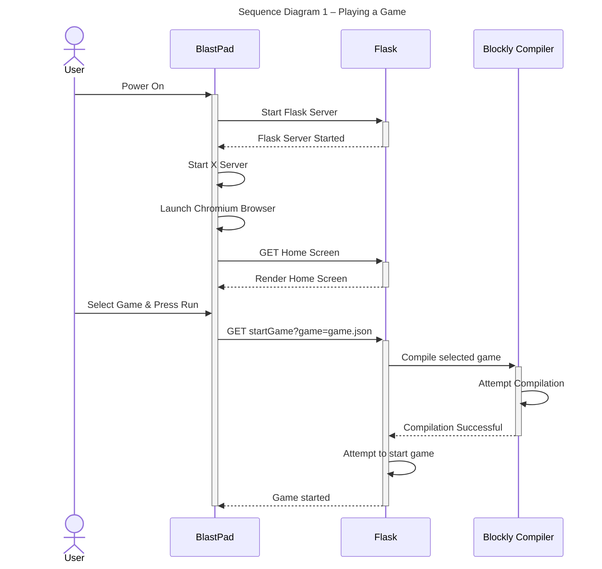

## Use Case 2 - Develop a Game using the BlastPad
A user would like to develop a game using the BlastPad with Blockly.

1. The user turns on the BlastPad and is presented with the home screen.
2. The user selects the "New Game" icon from the home screen's game gallery and is presented with the code editor.
3. The user creates a new game in the editor.
4. The user saves their game.

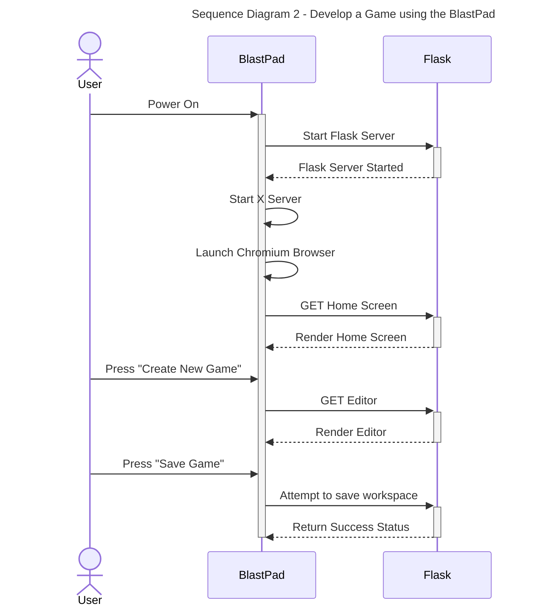

## Use Case 3 - Develop game using laptop
A user would like to develop a game for the BlastPad with their laptop.
1. The user turns on the BlastPad.
2. The user connects to the BlastPad's hotspot and accesses the Block Editor from their browser.
3. The user is presented with the games on their BlastPad and the option to create a new game. The user chooses to create a new game.
4. The user creates their game and presses the save button. 

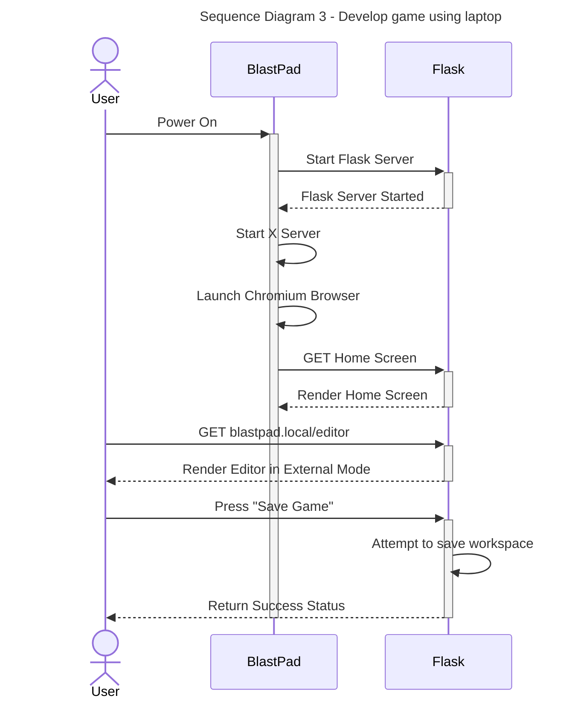

## Use Case 4 - Debugging your game
A user’s Blockly code fails during compilation and they would like to view the error message in order to debug their blocks.

1. The user starts the BlastPad.
2. Then chooses the saved created game from menu.
3. Then the user runs the game/hits play.
4. When the code compilation fails, the user will receive an error message stating which block failed to compile.

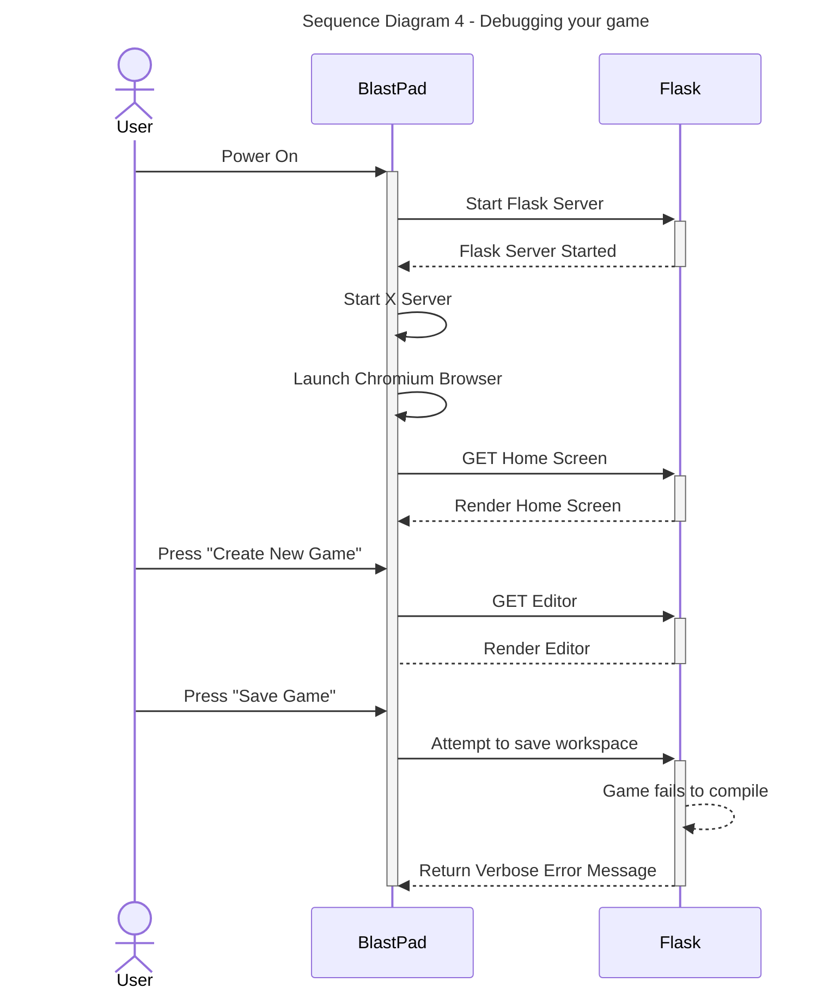

## Use Case 5 - Joining a Classroom
A user would like to join a classroom from the BlastPad.

1. The user turns on the BlastPad.
2. Then clicks on the Settings Page and clicks on the "Classroom" option on the sidebar .
3. Then selects the “Join” option on the displayed "Classroom" page.
4. Then the user types in the invite code given to them by their instructor and hits enter.
5. The user will be shown a successful "Joined" message.

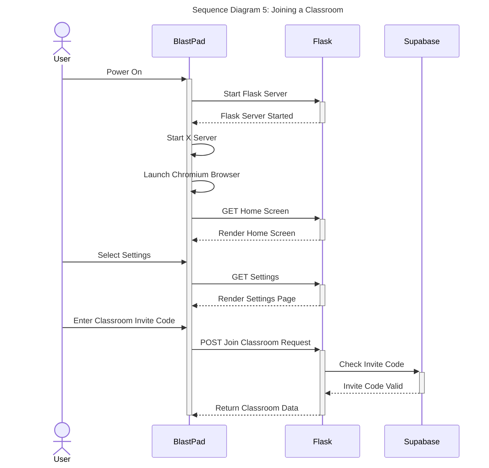

## Use Case 6 - Downloading a Game from a Classroom
A user would like to view their classmate's games and play one.

1. The user turns on the BlastPad.
2. Then selects the “Classroom” option on the main menu of the home screen.
3. The user scrolls through the list of published games in the Classroom and selects one for download.
4. The user plays the downloaded game on their BlastPad.

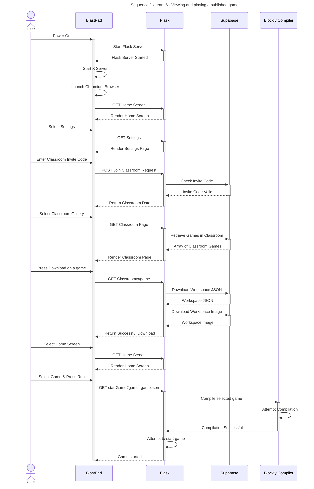
## Use Case 7 - Uploading a game to a Classroom
A user would like to upload a game to a Classroom

1. The user turns on the BlastPad.
2. Then selects the menu to publish a game file.
3. Then the user selects the "Upload to Classroom" button.
4. The user receives a confirmation message that the game was uploaded to the Classroom.

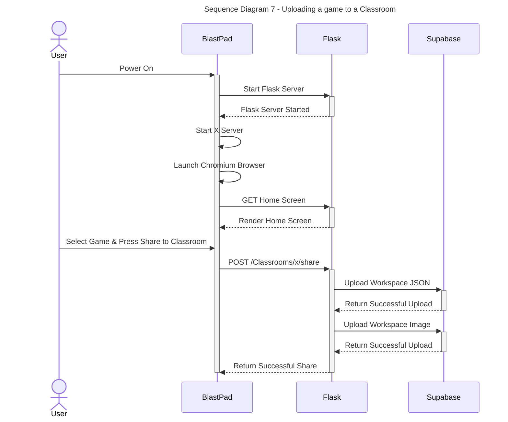

## Use Case 8 - Downloading a Game from the Community Hub
A user would like to view the games on the Community Hub and play one.

1. The user turns on the BlastPad.
2. Then selects the "Community Hub" option on the main menu of the home screen.
3. The user scrolls through the list of published games in the Community Hub and selects one for download.
4. The user plays the downloaded game on their BlastPad.

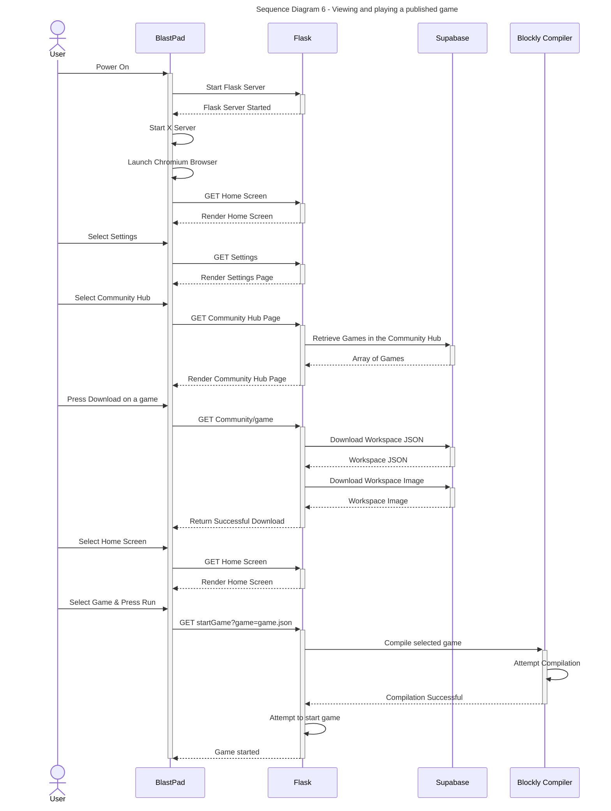

## Use Case 9 - Uploading a game to the Community Hub
A user would like to upload a game to the Community Hub.

1. The user turns on the BlastPad.
2. Then selects the menu to publish a game file.
3. Then the user selects the "Upload to Community Hub" button.
4. The user receives a confirmation message that the game was uploaded to the Community Hub.

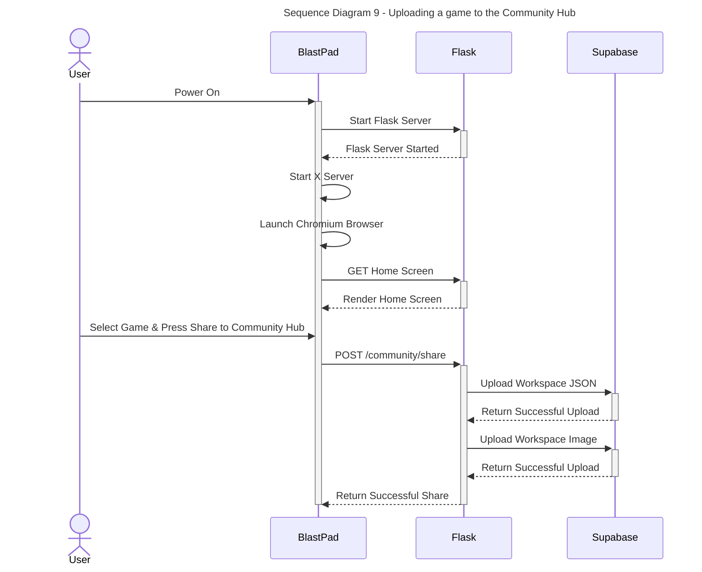

## Use Case 10 - Creating a Classroom
A user/teacher would like to a create a classroom to host BlastPad projects for students

1. The instructor turns on the BlastPad.
2. Then connects a keyboard and mouse to the BlastPad
3. Then clicks on the Settings Page and clicks on the "Classroom" option on the sidebar .
4. Then selects the “Create” option on the displayed "Classroom" page.
5. Then the instructor types in a classroom name, description, their own name, and an invite code.
6. Then hits the “Create Classroom” button
7. The instructor will be shown a successful "Created" message and be returned to the "Classroom" page automatically joined in the created Classroom.

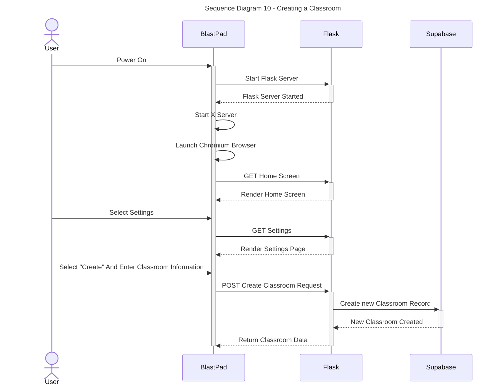

## Use Case 11 - Configuring the WiFi
A user would like to configure the WiFi for the BlastPad.

1. The user turns on the BlastPad (likely for the first time).
2. Then selects the “Setting” icon on the main menu of the home screen.
3. Then selects the "WiFi" icon on the sidebar menu of the "Settings" page
4. Then selects the network they want to connect to from the scrollable list of available networks in the displayed "WiFi" page.
5. Then the user types in the Network key and hits enter.
6. The user is successfully connected and returned to the "WiFi" page displaying their connection status.

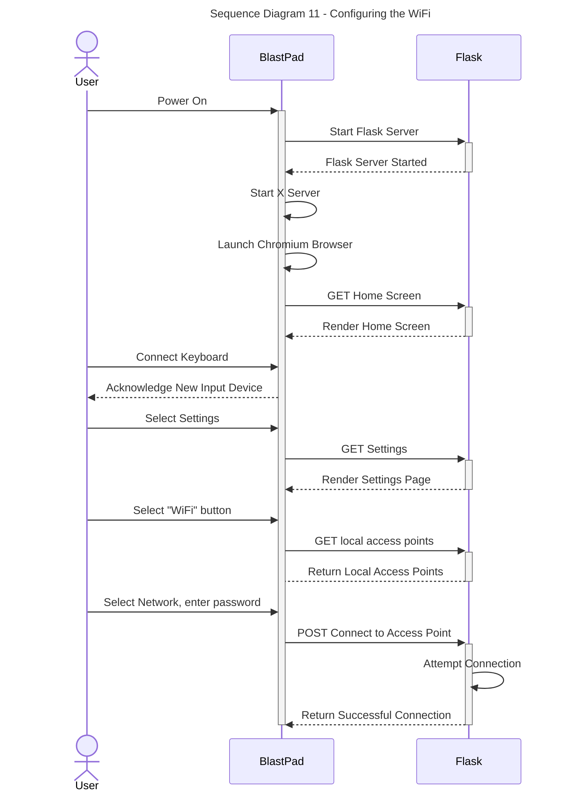