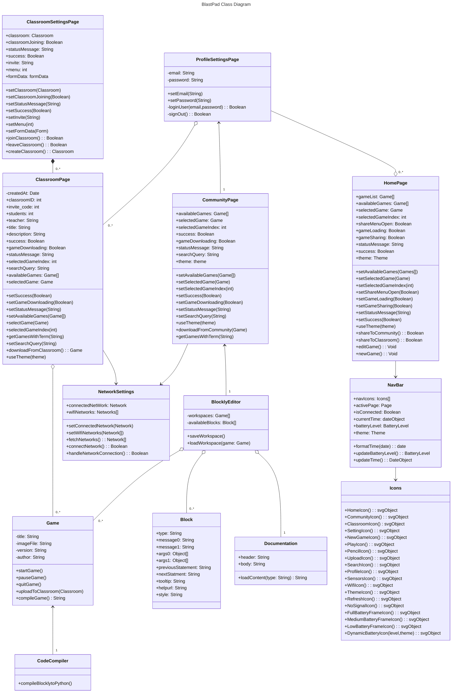

# Class Diagram

## Class Relationships
The class diagram above demonstrates various relationships between different classes within the BlastPad system. The **ProfileSettingsPage** is responsible for the user settings which is linked to the **HomePage**. Furthermore, the **CommunityPage** is dependent on the user's **ProfileSettingsPage** to upload and share games. The **CommunityPage** and the **ClassroomPage** are both dependant on the **NetworkSettings** class to provide an internet connection in order to share and download games. The **NavBar** is responsible for allowing navigation and information about battery and wifi connection through different elements. This class depends on the **Icons** class which returns different SVG elements for buttons and icons to render. The **HomePage** also makes use of the **Icons** class in a similar fashion.

The **Game**, **CodeCompiler**, **BlocklyEditor** and the **Block** classes are all dependent on each other. This is because together, they form the most vital part of the BlastPad which is game creation and compilation. This is what makes the BlastPad such an amazing and fun learning tool.

## `Block`
- Describes the properties necessary to define and create a Blockly code block

## `BlocklyEditor`
- Allows the user to work on Blockly based projects and create/place code blocks within it

## `ClassroomPage`
- Acts as a platform to host user-created Blockly games belonging in a classroom

## `ClassroomSettingsPage`
- Lets the user interact with classrooms

## `CodeCompiler`
- Converts the raw Blockly JSON definition into a runnable code Block in Python

## `NetworkSettings`
- Manages the Blastpad's WiFi connection supporting scanning for new networks, connecting to one, and disconnecting from one

## `Documentation`
- Loads help documentation for the Blockly code blocks

## `Game`
- Contains the metadata of a Blockly game, allows users to play the game it defines, and upload it to a Classroom

## `CommunityPage`
- Allows for all users to upload their games and download games without belonging to a classroom.

## `ProfileSettingsPage`
- Allows for users to create an account.

## `HomePage`
- The main screen for the BlastPad allowing for game edits, sharing and other features.

## `Icons`
- A list of functions which return different SVG objects for the Navbar and other components to render.

## `NavBar`
- The Navigation Bar of the BlastPad featuring buttons for navigating the UI and Wifi/Battery elements.

<!-- A check list for architecture design is attached here [architecture\_design\_checklist.pdf](https://templeu.instructure.com/courses/106563/files/16928870/download?wrap=1 "architecture_design_checklist.pdf")  and should be used as a guidance. -->
