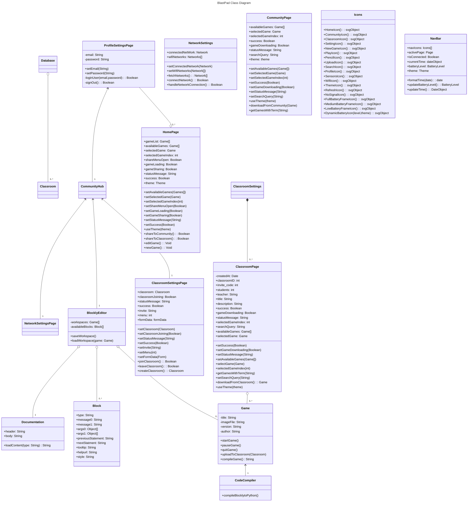

# Class Diagram

## Class Relationships

The class diagram above demonstrates various relationships between classes within the BlastPad system. The **User** class is associated with the **DeviceManager** class, indicating that a user can interact with the device via the device manager. The **DeviceManager** class is also associated with the **Gallery** for loading it, as indicated by the loadGallery() method. Furthermore, the **Gallery** class is connected to the **ClassroomManager**, allowing users to view multiple classrooms, as shown by the viewClassrooms() method.

The **ClassroomManager** maintains a one-to-many relationship with the **Classroom** class, signifying that it can manage multiple **Classrooms**. Each **Classroom** is capable of handling multiple **Game** objects, as depicted by their **one-to-many** association. The **Game** class is similarly connected to the **BlocklyEditor** class through a **one-to-many** relationship, suggesting that the **BlocklyEditor** can manage numerous **Block** objects.

The **Database** class has a **one-to-many link** with both the **User** and **Classroom** classes, indicating that it stores and manages data from both Users and **Classrooms**.

The **Block** class has a **one-to-many** relationship with the **Sensor** class, illustrating that blocks can access and utilize one or many sensors. The **Documentation** class is standalone but associated with the **BlocklyEditor** to provide tutorials for different blocks in the **BlocklyEditor**.

Lastly, the **Gallery** class is linked to the **Configuration** class to handle WiFi connections.

## `Block`
- Describes the properties necessary to define and create a Blockly code block

## `BlocklyEditor`
- Allows the user to work on Blockly based projects and create/place code blocks within it

## `Classroom`
- Acts as a platform to host user-created Blockly games

## `ClassroomManager`
- Lets the user interact with classrooms

## `CodeCompiler`
- Converts the raw Blockly JSON definition into a runnable code Block in Python

## `Configuration`
- Manages the Blastpad's WiFi connection supporting scanning for new networks, connecting to one, and disconnecting from one

## `Documentation`
- Loads help documentation for the Blockly code blocks

## `Game`
- Contains the metadata of a Blockly game, allows users to play the game it defines, and upload it to a Classroom

<!-- A check list for architecture design is attached here [architecture\_design\_checklist.pdf](https://templeu.instructure.com/courses/106563/files/16928870/download?wrap=1 "architecture_design_checklist.pdf")  and should be used as a guidance. -->
