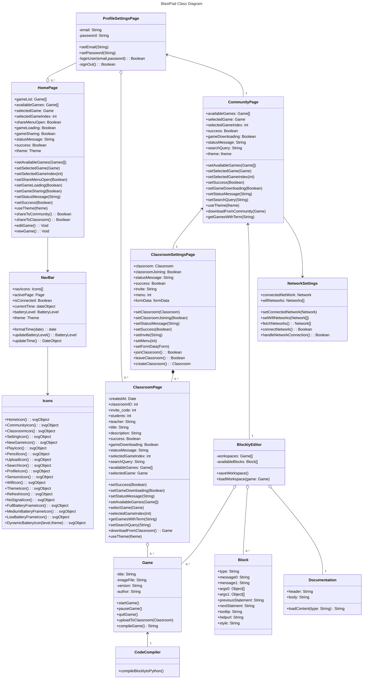

# Class Diagram

## Class Relationships

## `Block`
- Describes the properties necessary to define and create a Blockly code block

## `BlocklyEditor`
- Allows the user to work on Blockly based projects and create/place code blocks within it

## `ClassroomPage`
- Acts as a platform to host user-created Blockly games belonging in a classroom

## `ClassroomSettingsPage`
- Lets the user interact with classrooms

## `CodeCompiler`
- Converts the raw Blockly JSON definition into a runnable code Block in Python

## `NetworkSettings`
- Manages the Blastpad's WiFi connection supporting scanning for new networks, connecting to one, and disconnecting from one

## `Documentation`
- Loads help documentation for the Blockly code blocks

## `Game`
- Contains the metadata of a Blockly game, allows users to play the game it defines, and upload it to a Classroom

## `CommunityPage`
- Allows for all users to upload their games and download games without belonging to a classroom.

## `ProfileSettingsPage`
- Allows for users to create an account.

## `HomePage`
- The main screen for the BlastPad allowing for game edits, sharing and other features.

## `Icons`
- A list of functions which return different SVG objects for the Navbar and other components to render.

## `NavBar`
- The Navigation Bar of the BlastPad featuring buttons for navigating the UI and Wifi/Battery elements.

<!-- A check list for architecture design is attached here [architecture\_design\_checklist.pdf](https://templeu.instructure.com/courses/106563/files/16928870/download?wrap=1 "architecture_design_checklist.pdf")  and should be used as a guidance. -->
