# Design

## Class Diagram

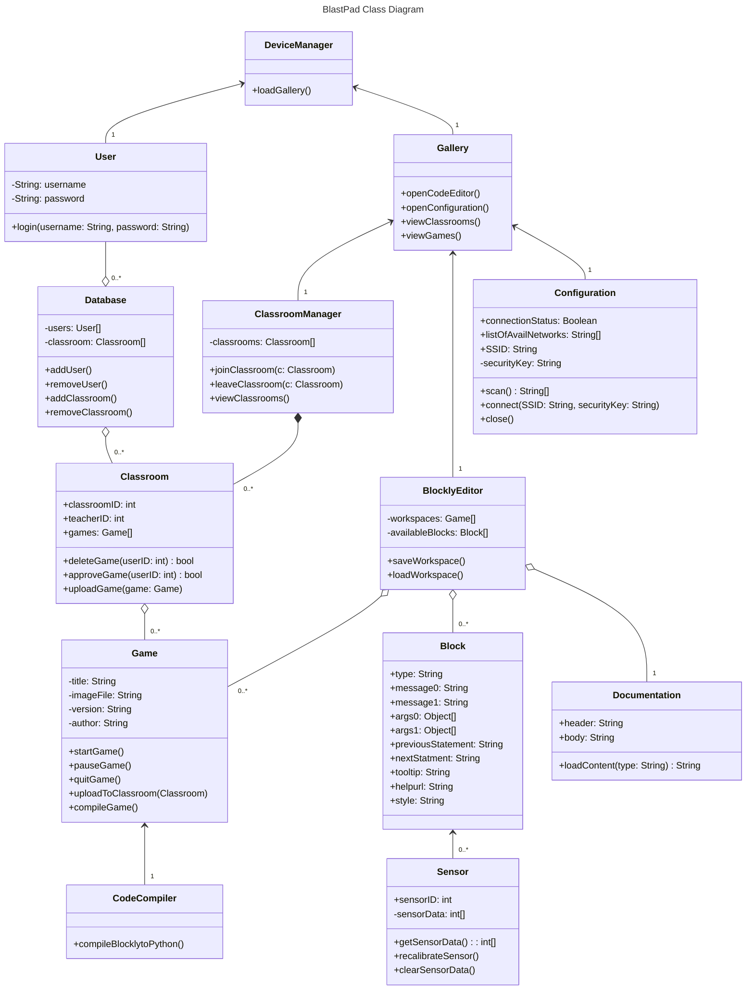
The class diagram above demonstrates various relationships between classes within the BlastPad system. The User class is associated with the DeviceManager class, indicating that a user can interact with the device via the device manager. The DeviceManager class is also associated with the Gallery for loading it, as indicated by the loadGallery() method. Furthermore, the Gallery class is connected to the Classroom Manager, allowing users to view multiple classrooms, as shown by the viewClassrooms() method.

The ClassroomManager maintains a one-to-many relationship with the Classroom class, signifying that it can manage multiple Classrooms. Each Classroom is capable of handling multiple Game objects, as depicted by their one-to-many association. The Game class is similarly connected to the BlocklyEditor class through a one-to-many relationship, suggesting that the BlocklyEditor can manage numerous Block objects.

The Database class has a one-to-many link with both the User and Classroom classes, indicating that it stores and manages data from both Users and Classrooms.

The Block class has a one-to-many relationship with the Sensor class, illustrating that blocks can access and utilize one or many sensors. The Documentation class is standalone but associated with the BlocklyEditor to provide tutorials for different blocks in the BlocklyEditor.

Lastly, the Gallery class is linked to the Configuration class to handle WiFi connections.

## Sequence Diagrams

### Use Case 1 – Playing a Game
A user would like to play a game on their BlastPad.

1. The user turns on the BlastPad, and is presented with the Home Screen.
2. The user selects a game from their downloaded games, and is presented with the Play, Edit, and Upload buttons.
3. The user presses the Play button. BlastPad compiles the game and launches it.
4. The user plays the game!

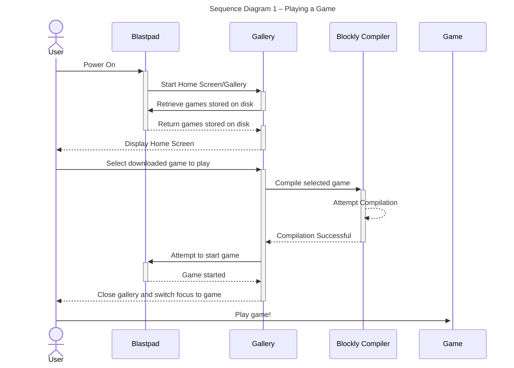

### Use Case 2 - Develop a Game using the BlastPad
A user would like to develop a game using the BlastPad with Blockly.

1. The user turns on the BlastPad and is presented with the home screen.
2. The user selects the "New Game" icon from the home screen's game gallery and is presented with the code editor.
3. The user creates a new game in the editor.
4. The user saves their game.

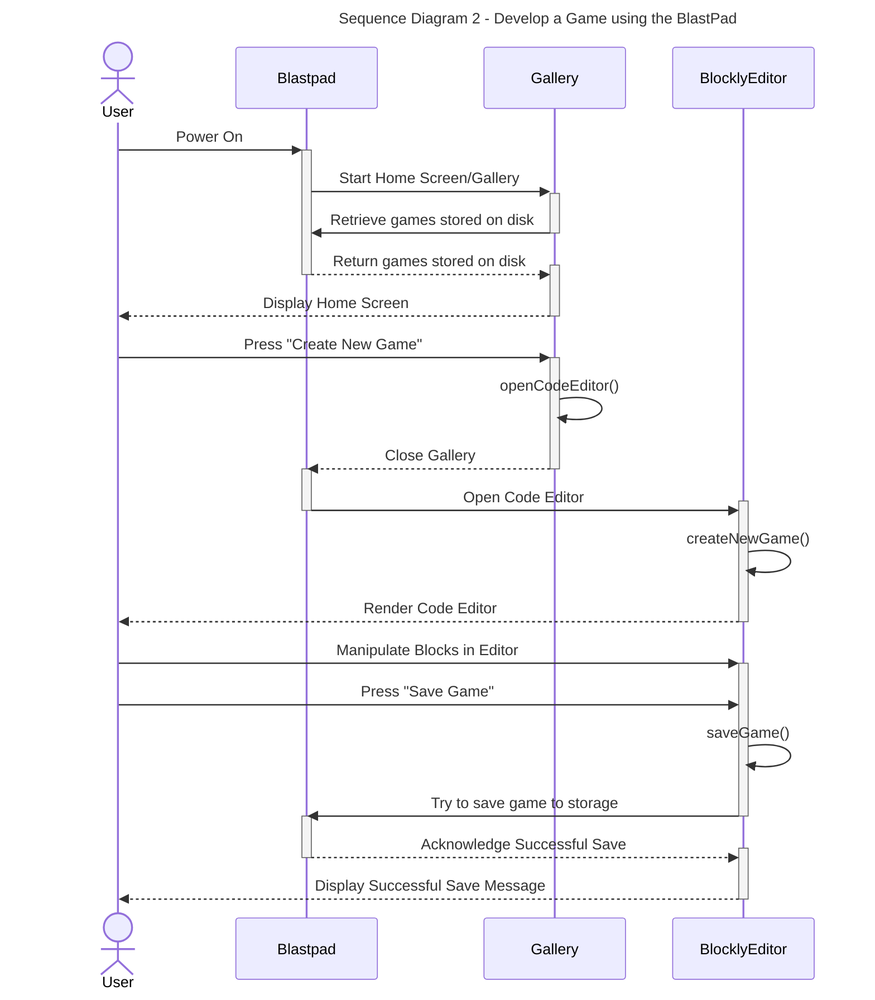

### Use Case 3 - Develop game using laptop
A user would like to develop a game for the BlastPad with their laptop.
1. The user turns on the BlastPad.
2. The user connects to the BlastPad's hotspot and accesses the Block Editor from their browser.
3. The user is presented with the games on their BlastPad and the option to create a new game. The user chooses to create a new game.
4. The user creates their game and presses the save button. 

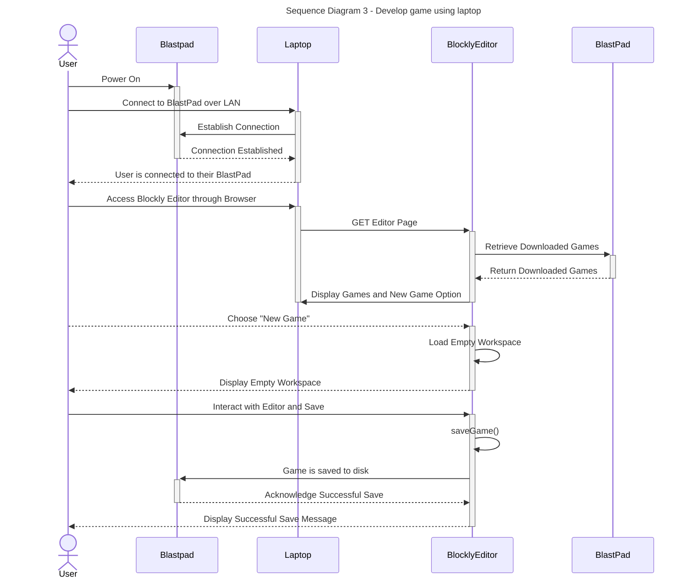

### Use Case 4 - Debugging your game
A user’s Blockly code fails during compilation and they would like to view the error message in order to debug their blocks.

1. The user starts the BlastPad.
2. Then chooses the saved created game from menu.
3. Then the user runs the game/hits play.
4. When the code compilation fails, the user will receive an error message stating which block failed to compile.

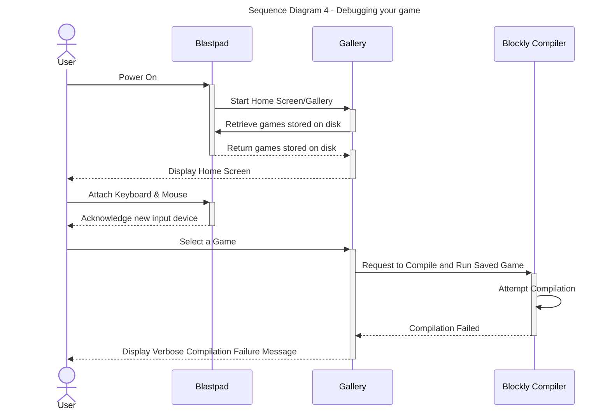

### Use Case 5 - Creating a Classrooms Account
A user would like to create a Classrooms account for their BlastPad.

1. The user turns on the BlastPad and attaches their keyboard and mouse.
2. The user selects the “Account” button on the main menu of the home screen, which presents a choice between Login and Create Account.
3. The user selects “Create Account” and enters a username and password.
4. After entering the username and password, the user confirms their password by re-entering it.
5. The BlastPad displays a success message and returns the user to the home screen.

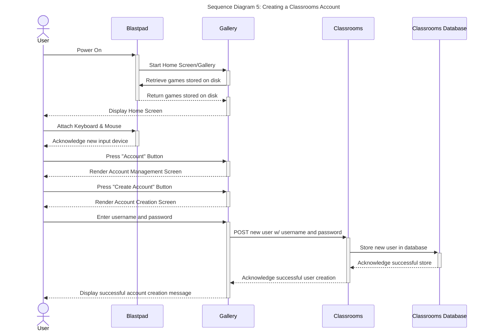

### Use Case 6 - Joining a Classroom
A user would like to join a classroom from the BlastPad.

1. The user turns on the BlastPad.
2. Then connects a keyboard and mouse to the BlastPad
3. Then selects the “Classroom” option on the main menu of the home screen.
4. Then selects the “Join Classroom” button from the “Classroom” page menu.
5. Then the user types in the share link given to them by their instructor and hits enter..
6. The user will be returned to the home screen.

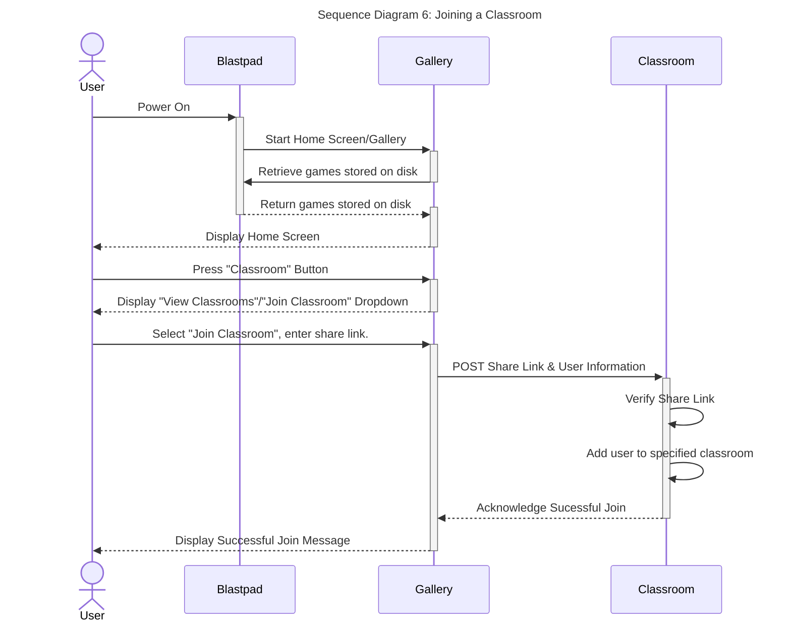

### Use Case 7 - Viewing and playing a published game
A user would like to view their classmate's games and play one.

1. The user turns on the BlastPad.
2. Then connects a keyboard and mouse to the BlastPad.
3. Then selects the “Classroom” option on the main menu of the home screen.
4. Then selects the “View Classroom(s)” button from the “Classroom” page menu.
5. Then the user scrolls through the list of Classrooms they have joined and selects one.
6. The user scrolls through the list of published games in the Classroom and selects one for download.
7. The user plays the downloaded game on their BlastPad.

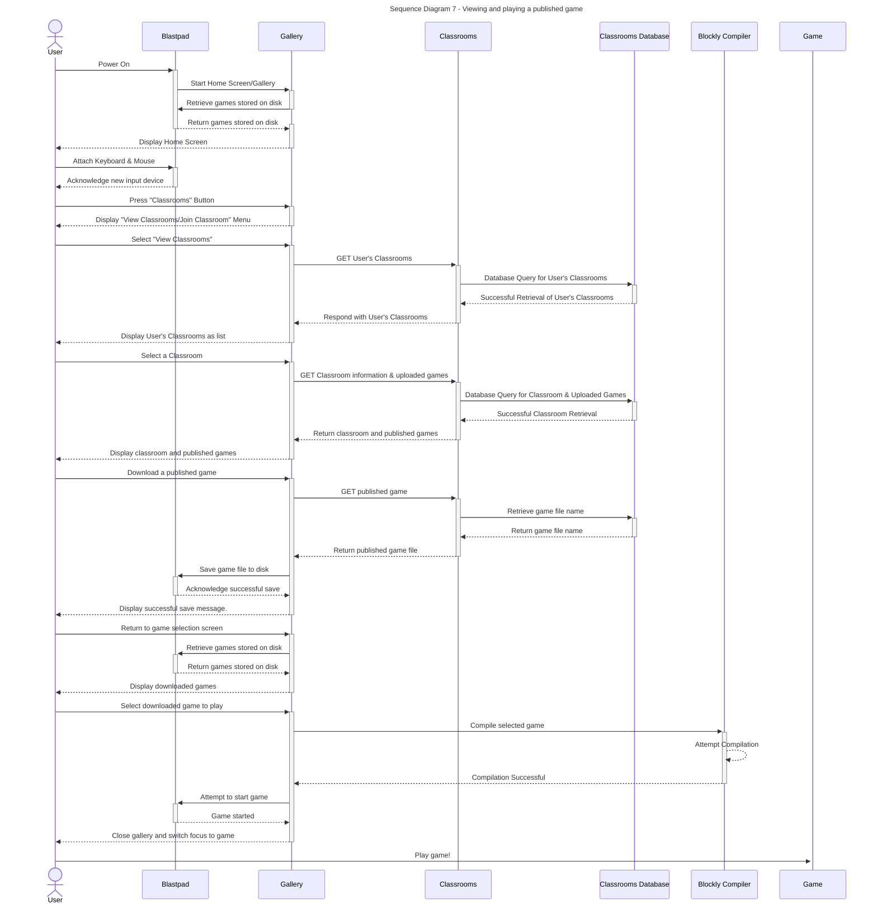

### Use Case 8 - Uploading a game to a Classroom
A user would like to upload a game to a Classroom

1. The user turns on the BlastPad.
2. Then connects a keyboard and mouse to the BlastPad.
3. Then selects the menu to publish a game file.
4. Then the user selects the "Upload to Classroom" button and selects the specific Classroom for upload.
5. The user receives a confirmation message that the game was uploaded to the Classroom pending approval if that was set.

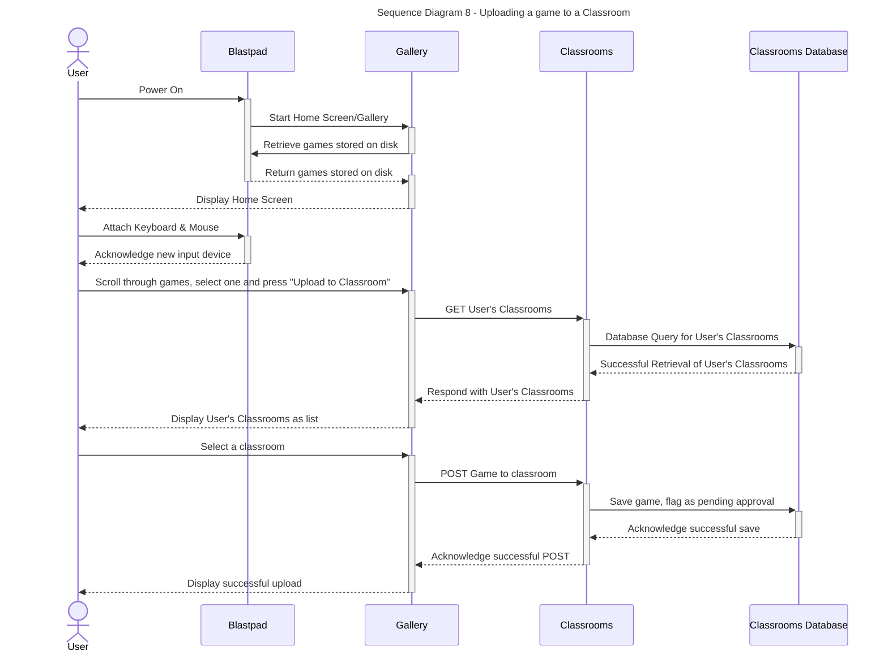

### Use Case 9 - Creating a Classroom
A user/teacher would like to a create a classroom to host BlastPad projects for students

1. The user visits the BlastPad™ website.
2. Then logs in/creates an account as an educator (verified by email domain)
3. Then selects the “Create Classroom” option from the educator dashboard.
4. Then the user configures the Classroom’s permissions
5. The user creates a special share link for students to join from their BlastPad

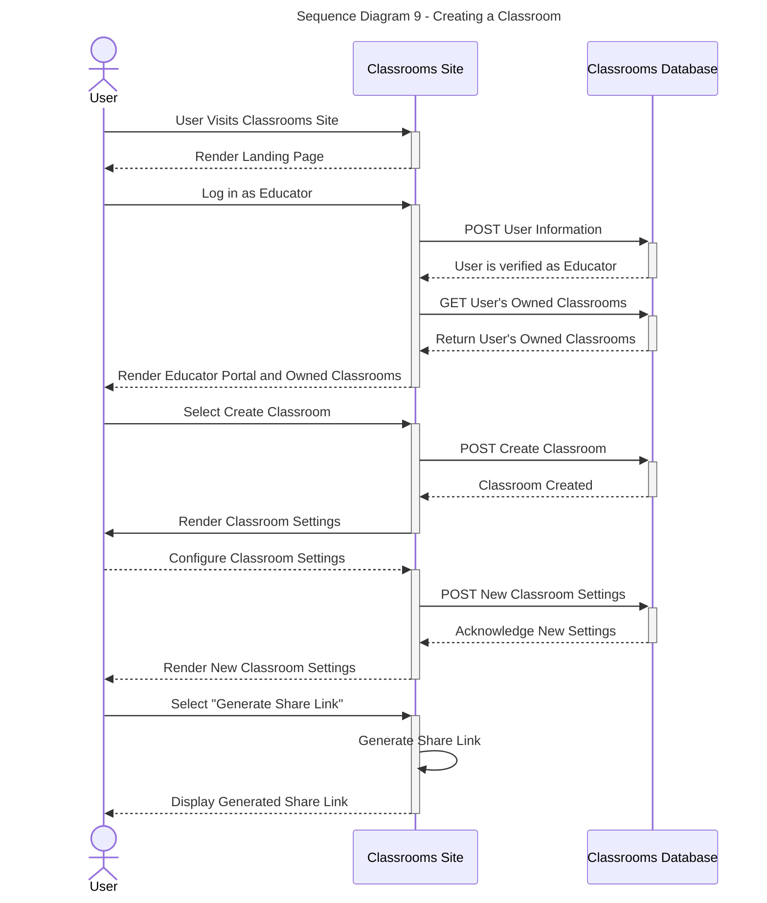

### Use Case 10 - Approving an uploaded game for public visibility in a Classroom
A user/teacher would like to approve an uploaded game to be visible in the Classroom

1. The user visits the BlastPad™ website.
2. Then logs in as an educator.
3. Then receives a notification on the educator dashboard that a game has been uploaded.
4. Then the user connects a BlastPad to their computer to view the game code in the editor or play it.
5. The user approves the game on the dashboard making the game visible within the Classroom.

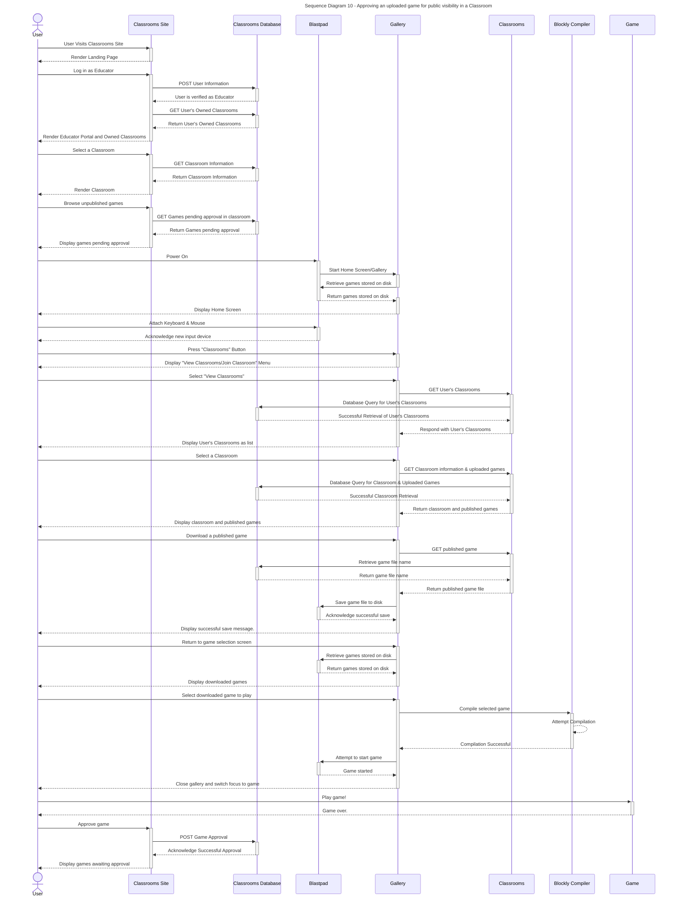

### Use Case 11 - Configuring the WiFi
A user would like to configure the WiFi for the BlastPad.

1. The user turns on the BlastPad (likely for the first time).
2. Then connects a keyboard and mouse to the BlastPad.
3. Then selects the “WiFi” icon on the main menu of the home screen.
4. Then selects the network they want to connect to from the scrollable list of available networks.
5. Then the user types in the Network key and hits enter.
6. The user is successfully connected and returned to the home screen

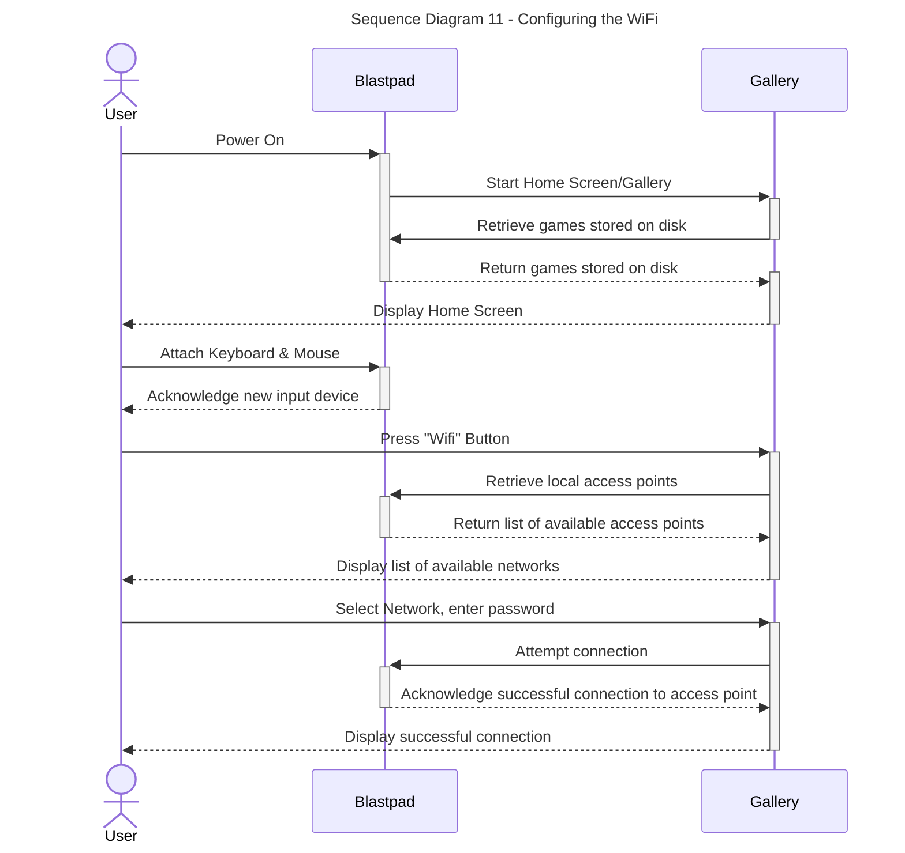

## Entity-relation diagram.

According to the following Entity-Relationship diagram below, there are four different relationships we can observe.
1. "Teaches in" Relationship
	This is a One-to-Many (1:N) relationship between Teachers and Classrooms. Each teacher can belong to multiple classrooms but each Classroom may only have a single Teacher.
	Furthermore, a Teacher belongs to 1 or many Classrooms and a Classroom may have one and only one Teacher.
2. "Contains"
	A One-to-Many (1:N) relationship between Classrooms and Students. Each Classroom may contain multiple Students, but each Student belongs to a single Classroom.
	Furthermore, Classrooms have one or many Students and a Student may belong to one and only one Classroom.
3. "Played by"
	A Many-to-Many (N:N) relationship between Students and Games. A Student may play multiple Games and a Game may be played by multiple Students.
	Furthermore, Games may belong to one or many Students and Students may have one or many Games.
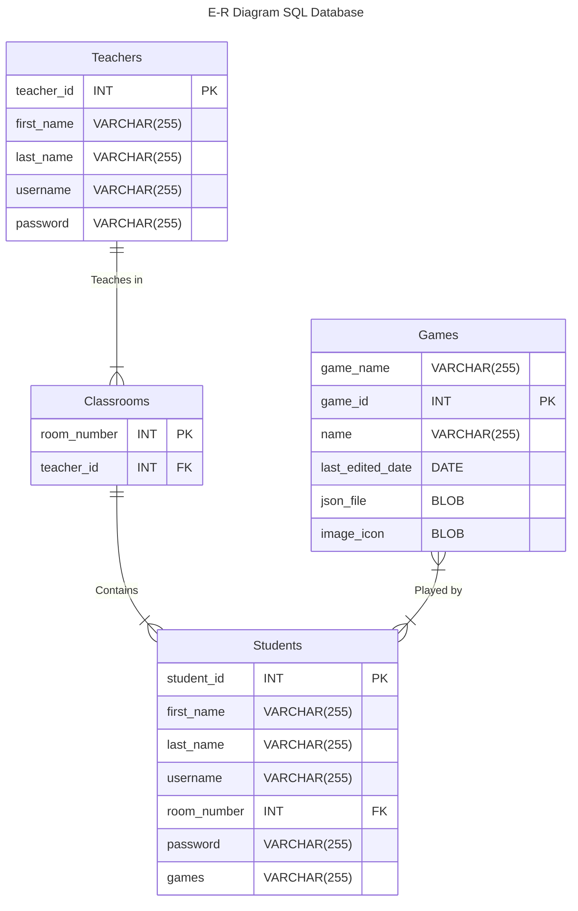

<!-- A check list for architecture design is attached here [architecture\_design\_checklist.pdf](https://templeu.instructure.com/courses/106563/files/16928870/download?wrap=1 "architecture_design_checklist.pdf")  and should be used as a guidance. -->
