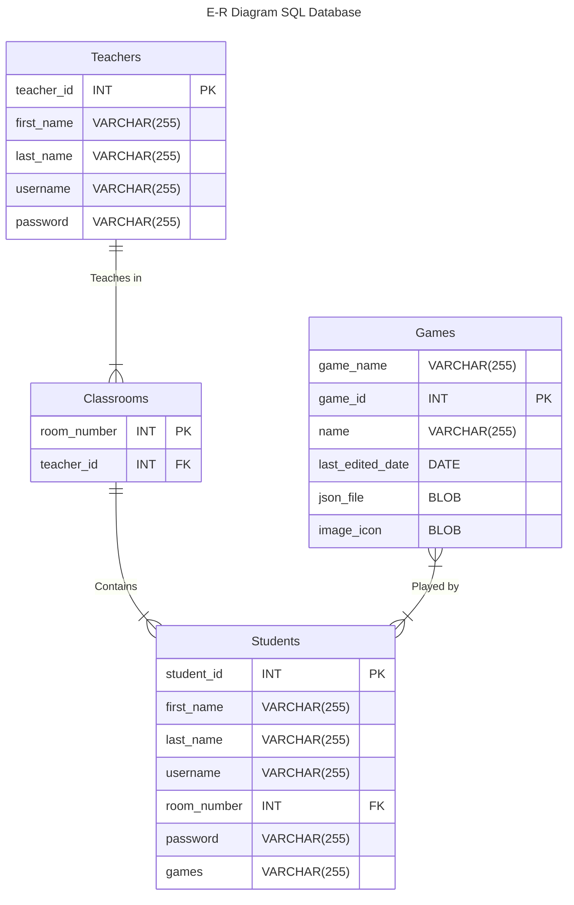

# Entity Relation Diagram

According to the following Entity-Relationship diagram below, there are four different relationships we can observe.
1. "Teaches in" Relationship
	This is a One-to-Many (1:N) relationship between Teachers and Classrooms. Each teacher can belong to multiple classrooms but each Classroom may only have a single Teacher.
	Furthermore, a Teacher belongs to 1 or many Classrooms and a Classroom may have one and only one Teacher.
2. "Contains"
	A One-to-Many (1:N) relationship between Classrooms and Students. Each Classroom may contain multiple Students, but each Student belongs to a single Classroom.
	Furthermore, Classrooms have one or many Students and a Student may belong to one and only one Classroom.
3. "Played by"
	A Many-to-Many (N:N) relationship between Students and Games. A Student may play multiple Games and a Game may be played by multiple Students.
	Furthermore, Games may belong to one or many Students and Students may have one or many Games.
