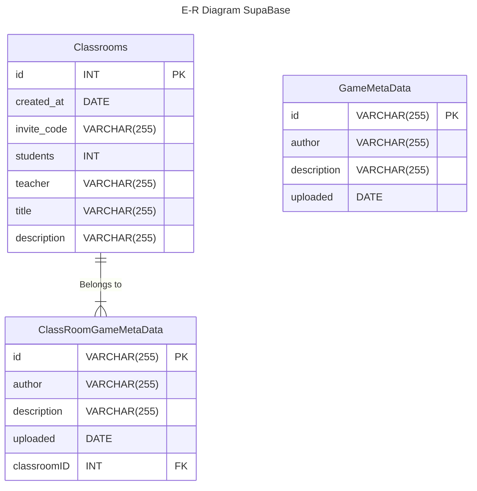

# Entity Relation Diagram

According to the following Entity-Relationship diagram below, there is 1 relationship we can observe according to our Supabase database.
1. "Belongs to" Relationship
This relationship is a 1 to many (1:N) relationship which shows that a single Classroom can own many ClassRoomGameMetaData entities.

The GameMetaData entity holds the description for an uploaded gamefile in the Comunity Hub.

